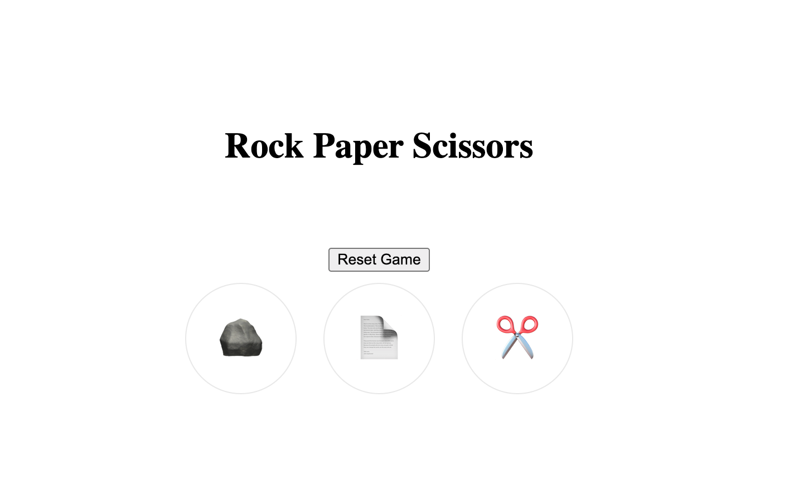

<<<<<<< HEAD
# ✊✋✌️ Rock, Paper, Scissors

## 🕹️ Description

This is a simple Rock, Paper, Scissors game made with HTML, CSS, and JavaScript.  
The player chooses rock, paper, or scissors. The computer makes a random choice.  
The game compares the choices and shows who wins. First to 5 points wins the match!

## 🚀 Getting Started

👉 **Play it here:** [https://your-deployment-link.com](https://your-deployment-link.com)

👉 **Planning Materials:**
- [User Stories](./planning/user-stories.md)
- [Wireframe](./planning/wireframe.png)

### How to Play
1. Open the link to the game.
2. Click Rock, Paper, or Scissors.
3. The computer will choose too.
4. The winner is shown. First to 5 points wins!

## 💡 Technologies Used

- HTML
- CSS
- JavaScript

## 📚 Attributions

- [Icons from Font Awesome](https://fontawesome.com/)

## 🚧 Next Steps

- Add sound effects
- Add animations
- Make it work on phones
=======

>>>>>>> 7ebc36d2714d2afbd06dda71e8ed65cc494d545d
